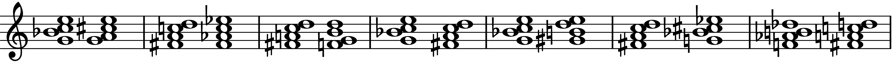

# Septima library documentation

## Introduction

### Overview
Septima is a C++ library for investigating tonal relations between seventh chords.

#### Features
* generating elementary transitions between seventh chords
* creating chord networks
* finding optimal voicings for sequences of seventh chord symbols

A command-line interface is provided for using library features from a terminal.

### Dependencies
1. GCC
2. Standard Template Library (STL)
2. GNU Linear Programming Kit ([GLPK](https://www.gnu.org/software/glpk/))
3. GNU Scientific Library ([GSL](https://www.gnu.org/software/gsl/))

### Installation

#### Library

In Ubuntu, dependencies can be installed by typing:

```
sudo apt-get install -y build-essential libglpk-dev libgsl-dev
```

To compile the library, type `make`.

#### Documentation

To convert this file to PDF, use [Grip](https://pypi.org/project/grip/):

```
pip install grip
grip README.md
```

Then click `http://localhost:xxxx/` which opens the rendering in browser. Print to file when ready.

## Command-line interface

After a successful compilation, executable `septima` will appear in the installation directory.

### Usage

In a Linux terminal, the executable is called like this:

```
./septima <task> [<option(s)>] CHORDS or FILE
```

#### Tasks
- `-h`, `--help` &mdash; Show this help message.
- `-t`, `--transition` &mdash; Generate transitions between two seventh chords.
- `-tc`, `--transition-classes` &mdash; Generate all structural classes of transitions between seventh chords.
- `-cg`, `--chord-graph` &mdash; Create chord graph from a set of chords.
- `-v`, `--voicing` &mdash; Find an optimal voicing for the given chord sequence.
- `-av`, `--all-voicings` &mdash; Find all optimal voicings for the given chord sequence.

#### Options
- `-c`, `--class` &mdash; Specify upper bound for voice-leading infinity norm. Default: 7.
- `-dg`, `--degree` &mdash; Specify degree of elementary transitions. Default: unset.
- `-aa`, `--allow-augmented` &mdash; Allow augmented realizations. By default, German sixths and Tristan chords are disabled.
- `-d`, `--domain` &mdash; Specify domain on the line of fifths. It is entered as a comma-separated list of integers. Blocks of several consecutive integers, such as e.g. 1,2,3,4,5, can be entered as 1:5. The default domain is {−15,−14,…,15}, which corresponds to notes from G&#119083; to A&#119082;.
- `-z`, `--tonal-center` &mdash; Specify tonal center on the line of fifths. Default: 0, which corresponds to the note D.
- `-lf`, `--label-format` &mdash; Specify format for chord graph labels. Choices are *symbol*, *number*, and *latex*. Default: *symbol*.
- `-p`, `--preparation` &mdash; Specify preparation scheme for elementary transitions. Choices are *none*, *generic* (for preparation of generic sevenths), and *acoustic* (for preparation of acoustic sevenths). Default: *none*.
- `-w`, `--weights` &mdash; Specify weight parameters for the voicing algorithm. Three nonnegative floating-point values are required: tonal-center proximity weight *w*&#8321;, voice-leading complexity weight *w*&#8322;, and penalty *w*&#8323; for augmented sixths. By default, *w*&#8321; = 1.0, *w*&#8322; = 1.75, and *w*&#8323; = 0.25.
- `-vc`, `--vertex-centrality` &mdash; Show centrality measure with each vertex of the chord graph. Choices are *none*, *label*, and *color*. Default: *none*.
- `-ly`, `--lilypond` &mdash; Output transitions and voicings in Lilypond code.
- `-cs`, `--chord-symbols` &mdash; Print chord symbols above realizations in Lilypond output.
- `-q`, `--quiet` &mdash; Suppress messages.

#### Entering chords

Chords are entered using symbols in form `<root>:<quality>`. Root is one of the integers 0,1,…,11, which represent pitch classes. Quality is either `d7` (dominant seventh), `hdim7` (half-diminished seventh), `m7` (minor seventh), `maj7` (major seventh), or `dim7` (diminished seventh). Optionally, root can be left unspecified (in that case the colon is also not entered), in which case all seventh chords of the given quality are generated. For example, `dim7` is equivalent to `0:dim7 1:dim7 2:dim7` (there are 3 diminished seventh chords in total).

Septima can also read chords from a file. Chords are entered using the same syntax as above and they are separated by either spaces, tabs, newlines, commas, or semicolons. These delimiters may be combined.

## Examples

### Transitions

#### Generating elementary transitions between two seventh chords

In this example we generate elementary transitions between the dominant seventh chord on C (C⁷) and the diminished seventh chord on B (B⁰⁷). Enter:

```
./septima -t -aa -ly 0:d7 11:dim7 >out.ly
```

This will output all transitions (including those with augmented sixths, since option `-aa` is used) in Lilypond format to the file `out.ly`. 

To generate a PNG image ([Lilypond](https://www.lilypond.org) has to be installed on your system), enter:

```
lilypond -dbackend=eps -dresolution=600 --png out.ly
rm out-*
```

The following output (`out.png`) is obtained:

<p align="center"></p>

#### Generating all structural classes of transitions between chords in the given set

For the given set of seventh chords, all possible elementary transitions are generated and split into structural-equivalence classes.
Each class is represented by the transition which is closest to the tonal center *z*. For example, we generate all classes of transitions between dominant seventh chords by typing:

```
./septima -tc -aa -ly d7 >out.ly
```

After converting `out.ly` to PNG using Lilypond, we obtain:

<p align="center"></p>

Hence there exist exactly seven structurally different ways to connect two dominant seventh chords using diatonic/chromatic voice leading.

To generate all classes of diatonic transitions between dominant, half-diminished, minor, and major seventh chords, enter:

```
./septima -tc -c 5 -ly -cs d7 hdim7 m7 maj7 >out.ly
```

Diatonic voice leading is obtained by setting `-c` option to 5. The option `-cs` enables printing chord symbols in the output. We obtain the following 25 transition types:

<p align="center"></p>

### Chord graphs

Chord graphs are output in [DOT format](https://graphviz.org/doc/info/lang.html). It may be worth noting that the free computer algebra system [Giac/Xcas](https://www-fourier.ujf-grenoble.fr/~parisse/giac.html) supports importing from DOT and features an extensive package for graph theory.

For example, to create the chord graph on minor seventh chords with edges corresponding to diatonic relations, enter:

```
./septima -cg -c 5 m7 >cg.dot
```

To visualize the graph, use [Graphviz](https://graphviz.org/). In this case it is best to use circular layout, obtained by typing:

```
circo -Tpng -o cg1.png cg.dot
```

The result is shown below. 

<p align="center"></p>

In the following example we create the chord graph on all dominant and half-diminished seventh chords which can be realized in the domain from F&flat; to B&sharp; on the line of fifths, excluding the tones C, G, D, and A. Those chords which cannot be realized in the domain are not included in the graph. Note that the resulting graph is directed because the option `-p` is set to `generic` and hence only transitions in which the generic seventh of second chord is prepared in the first chord are considered. 

```
./septima -cg -d -10:-3,2:10 -p generic d7 hdim7 >cg.dot
dot -Tpng -Grankdir=LR -o cg2.png cg.dot
```

The result is shown below.

<p align="center"></p>

For creating chord graphs with nicely typeset chord symbols, consider setting the option `-lf` to `latex`. In that case, `./septima` outputs a file to be processed with [dot2tex](https://dot2tex.readthedocs.io/en/latest/). For example, a chord graph on the set {C⁷, E&flat;⁷, F&sharp;⁷, A&#9651;, B&flat;&#216;} is created. After that, Graphviz is called to create `xdot` format, which is passed to dot2tex (note that `--crop` option is used). The resulting TeX file is compiled with PDFLatex and converted to PNG using pdftoppm (from [Poppler](https://poppler.freedesktop.org/)), as follows.

```
./septima -cg -p generic -lf latex 0:d7 3:m7 6:d7 9:maj7 10:hdim7 >cg.dot
circo -Txdot -o cg.xdot cg.dot
dot2tex --crop -tmath --figpreamble="\Large" -o cg.tex cg.xdot
pdflatex cg.tex
pdftoppm -png cg.pdf >cg.png
```

The result is shown below.

<p align="center"></p>

By setting the option `-vc` one can obtain more informative graphs. In that case, communnicability betweenness centrality (CBC) is computed for each vertex (see [this paper](https://arxiv.org/abs/0905.4102) by E. Estrada *et al.*). The original definition is adjusted for graphs which are not (strongly) connected. If `-vc` is set to `label` resp. `color`, then CBC measure *cₖ* is written in the **xlabel** resp. **fillcolor** attribute of the *k*-th vertex. When processed by Graphviz, *cₖ* is either shown near the respective vertex or it represents a particular color in the gray scale&mdash;represented by the segment [0, 1] where 0 and 1 correspond to white black color, respectively. For example, a chord graph on the set {C⁷, C&sharp;&#216;, Dm⁷, E&flat;&#9651;, G⁷, A&flat;&#216; Am⁷, B&flat;&#9651;} is visualized by typing:

```
./septima -cg -p generic -vc color 0:d7 7:d7 1:hdim7 8:hdim7 2:m7 9:m7 3:maj7 10:maj7 >cg.dot
circo -Tpng -o cg.png cg.dot
```

The obtained image is shown below. Darker vertices are more important as stepping-stones in chord progressions.

<p align="center"></p>

### Voicings

For example, to generate a voicing for the progression F&#216; &#8594; E⁷ &#8594; A&#9837;&#216; &#8594; G⁷ &#8594; D&#216; &#8594; B⁷, which appears at the beginning of Wagner's *Tristan*, enter:

```
./septima -v -aa -w 1.0 1.75 0.2 sequences/Wagner1.seq
```

The penalty for augmented sixths is set to 0.2, which is a bit lower than the defult 0.25. This way we obtain the Tristan chord at the beginning. The optimal voicing is output as a sequence of chord realizations.

```
Using GLPK 4.65
Finding optimal voicing for the sequence [5:hdim7,4:d7,8:hdim7,7:d7,2:hdim7,11:d7]
D#-F-G#-B
D-E-G#-B
D-F#-G#-B
D-F-G-B
D-F-Ab-C
D#-F#-A-B
Recommended key signature: 2 sharps
```

Note that the program also prints the recommended key signature at the end.